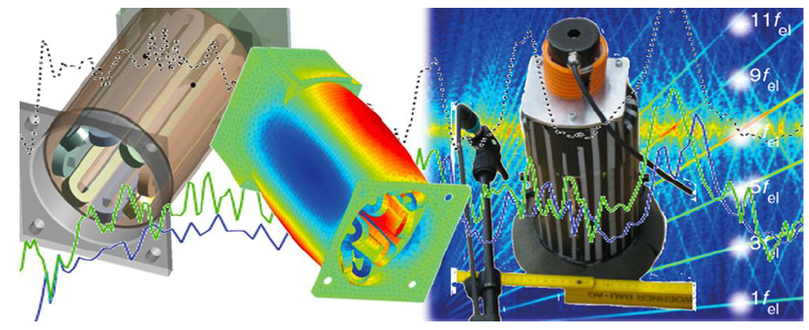

<!-- PROJECT LOGO -->
<br />
<p align="center">
  <a href="https://github.com/github_username/repo_name">
    
  </a>

  <h3 align="center">Project 1: Denoising & Robust Classification of Sound Signals</h3>

  <p align="center">
    ML-LAB WS 2020/2021
    <br />
  </p>
</p>


<!-- TABLE OF CONTENTS -->
<details open="open">
  <summary><h2 style="display: inline-block">Table of Contents</h2></summary>
  <ol>
    <li>
      <a href="#about-the-project">About The Project</a>
      <ul>
        <li><a href="#built-with">Built With</a></li>
      </ul>
    </li>
    <li>
      <a href="#getting-started">Getting Started</a>
      <ul>
        <li><a href="#prerequisites">Prerequisites</a></li>
        <li><a href="#installation">Installation</a></li>
      </ul>
    </li>
    <li><a href="#usage">Usage</a></li>
    <li><a href="#contact">Contact</a></li>
  </ol>
</details>


<!-- ABOUT THE PROJECT -->
## About The Project

[![Product Name Screen Shot][product-screenshot]](https://example.com)

The aim of this project is to implement audio signal classifiers and improve their performance. This has been done via two approaches:

- Approach 1: Denoising + Classification
- Approach 2: Data augmentation/Robust Training of end-to-end audio classifiers

This repo contain implementation of several baseline audio classifiers with Pytorch-lightning wrapper:
- CRNN: Convolutional recurrent neural networks (From paper https://arxiv.org/abs/1609.04243)
- M11 & M18: Very Deep CNN (From paper https://arxiv.org/pdf/1610.00087.pdf)

The audio classifiers can be trained with two dataset: [Urbansound8k](https://urbansounddataset.weebly.com/urbansound8k.html), 
which is publically availabe and BMW which is accessible only for this project. The repo provides Dataset and Dataloader for both datasets and in addition 
functionalities to add several types of audio transformations and audio augmentations. For certain additive augmentation, you may need to download 
backgorund noise clips from the MUSAN dataset (https://www.openslr.org/17/). If a new dataset with the same folder structure as BMW is added, an annotation file 
with stratified k-fold cross validation splits will be automatically generated  when training on this dataset for the first time.

We implemented several robustness methods:
- Mixup.
- Label smoothing: from paper https://arxiv.org/abs/1512.00567
- SmoothADV: from paper https://arxiv.org/abs/1906.04584

Finally, the repos provides two approaches to evaluate model robustness: (1) Certification radius: We created a SmoothClassfier
model wrapper for randomize smoothing procedures, which can also be used to calculate certification raidus. (2) Robust accuarcy 
under adversarial attacks: L-inf and L-2 fast gradient attacks on pre-trained models with varying attack radius.


We have created common routines to train, test and evaluate all models. Results from our experiements can be found on our [wiki](https://wiki.tum.de/display/mllab/Final+Results).

### Built With

* [pytorch_lightning](https://github.com/PyTorchLightning/pytorch-lightning). A lightweight PyTorch wrapper for high-performance AI research. Scale your models, not the boilerplate.
* [foolbox](https://foolbox.jonasrauber.de/). Fast adversarial attacks to benchmark the robustness of machine learning models in PyTorch, TensorFlow, and JAX


<!-- GETTING STARTED -->
## Getting Started

To get a local copy up and running follow these simple steps.

### Prerequisites

This is an example of how to list things you need to use the software and how to install them.
* npm
  ```sh
  npm install npm@latest -g
  ```

### Installation

1. Clone the repo
   ```sh
   git clone https://github.com/github_username/repo_name.git
   ```
2. Install NPM packages
   ```sh
   npm install
   ```


<!-- USAGE EXAMPLES -->
## Usage

The repo provides a key-value based config system that can be used to obtain standard, common behaviors when running experiments.
Our config system is inspired by the Detectron2 framework (link) and uses YAML. 


<!-- CONTACT -->
## Contact

Your Name - [@twitter_handle](https://twitter.com/twitter_handle) - email

Project Link: [https://github.com/github_username/repo_name](https://github.com/github_username/repo_name)
